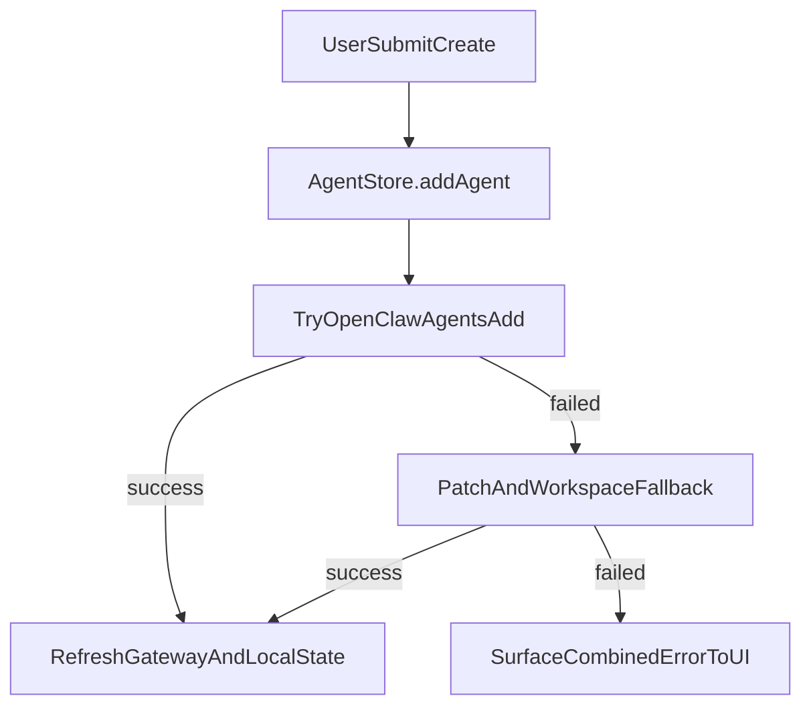

# 智能体创建改造方案

## 目标
把 ClawdHome 的“新建智能体”流程改成：
- 首选调用 OpenClaw 原生命令 `openclaw agents add <id>`；
- 若 CLI 路径失败，自动回退到当前实现（`config.patch + workspace 初始化`）；
- 仅影响后续新建，不改动已有不完整工作区。

## 变更点
- 在 [ClawdHome/Services/Stores/AgentStore.swift](/Users/charles/Desktop/WORK/clawdhome/ClawdHome/Services/Stores/AgentStore.swift) 中重构 `addAgent(...)`：
  - 拆分为 `tryAddAgentViaCLI(...)` 与 `addAgentViaPatchFallback(...)` 两段逻辑；
  - 主路径先走 CLI，失败时记录日志并回退。
- 复用/扩展 [ClawdHome/Services/Gateway/GatewayProcessManager.swift](/Users/charles/Desktop/WORK/clawdhome/ClawdHome/Services/Gateway/GatewayProcessManager.swift) 本地命令执行能力：
  - 增加一个 `agents add` 专用包装（参数构造、输出收集、错误返回）；
  - 保持执行环境与现有 `pairing` 命令一致，避免路径/权限差异。
- 在 [ClawdHome/Views/Agent/CreateAgentSheet.swift](/Users/charles/Desktop/WORK/clawdhome/ClawdHome/Views/Agent/CreateAgentSheet.swift) 维持现有 UI 交互：
  - 不改表单字段；
  - 创建失败时透出更明确错误（CLI 失败 + 回退失败的组合原因）。

## 执行流程（改造后）

## 验收标准
- 新建任意智能体后，对应 `workspace-<id>` 由 OpenClaw 原生流程生成（与 CLI 行为一致）。
- 若本机 CLI 执行异常（环境/命令失败），仍可通过旧路径成功创建，不阻断功能。
- 渠道绑定到新建智能体后，消息不再因“工作区骨架缺失”回落默认智能体。
- 现有智能体不被自动迁移或修改（符合你的范围选择）。