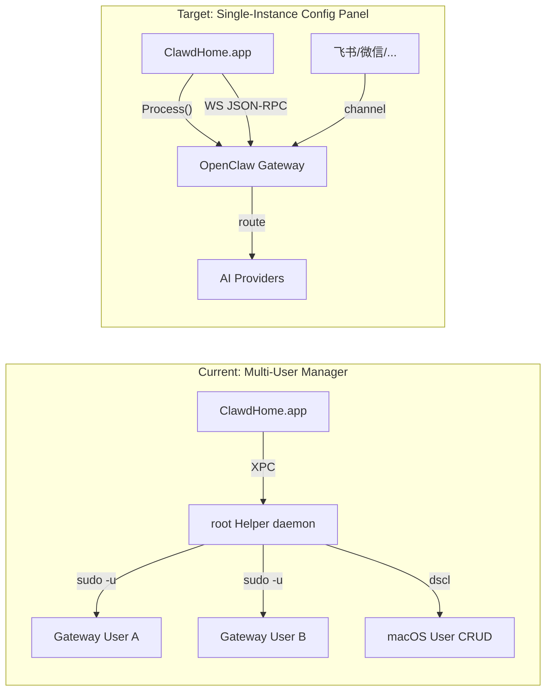
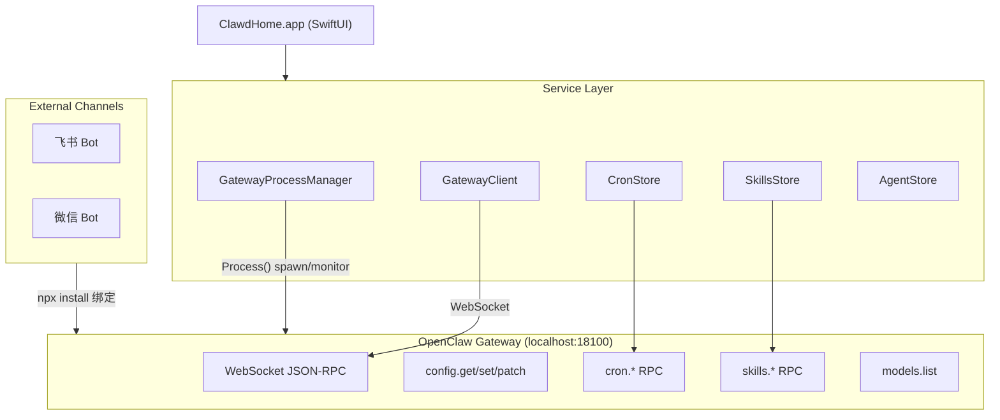
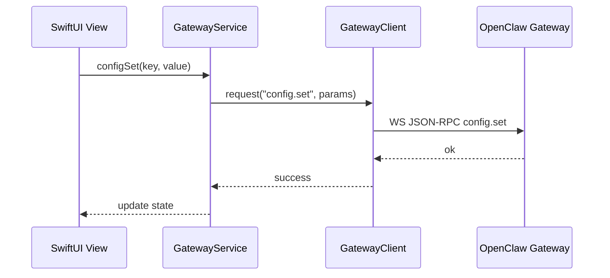

# ClawdHome 架构重设计：单实例智能体配置管理面板

## 一、产品定位

**不是聊天应用**。用户通过外部渠道（飞书/微信等）与智能体对话，ClawdHome 的职责是：

1. **一键部署** — pkg 安装即部署好 OpenClaw 环境
2. **智能体管理** — 预置角色展示、自定义智能体创建/编辑
3. **能力配置** — 定时任务、技能安装、消息渠道绑定、模型绑定

## 二、核心架构变更



**关键决策：去掉 XPC Helper Daemon**

- 不再创建/删除 macOS 用户 → `UserManager` 完全移除
- Gateway 运行在当前用户下 → 无需 root 权限
- 文件操作在 `~/.openclaw/` 下 → 无需跨用户访问
- 安装在 pkg 阶段完成 → 无需运行时 `npm install`
- 配置通过 Gateway WebSocket JSON-RPC 完成 → 不需要 helper 调 `openclaw config set`

## 三、安装体系（pkg 离线安装）

### pkg 内容结构

```
ClawdHome.pkg
├── ClawdHome.app                           → /Applications/
├── node (v22 LTS, arm64+x64 fat binary)   → App Bundle: Contents/Resources/node/
├── openclaw (npm package, 预打包 node_modules)
│                                           → App Bundle: Contents/Resources/openclaw/
└── scripts/
    └── postinstall                          → 初始化 ~/.openclaw/
```

### postinstall 脚本职责

1. 将 bundled openclaw 链接到 `~/.npm-global/` 或直接从 app bundle 内运行
2. 生成默认 `~/.openclaw/config.json`（固定端口 18100，生成随机 auth token）
3. 可选：注册 LaunchAgent `~/Library/LaunchAgents/ai.clawdhome.gateway.plist`（开机自启）

**优势**：不依赖网络、不需要 Homebrew/nvm，装完即用。

## 四、运行时架构

### 进程模型



### Service 层设计

**GatewayProcessManager** (新增)
- 用 `Process()` 启动 bundled node + openclaw (`Contents/Resources/node/bin/node Contents/Resources/openclaw/bin/openclaw.js`)
- 监控 stdout/stderr，crash 自动重启
- 提供 `start()` / `stop()` / `restart()` / `isRunning` 接口
- App 启动时自动拉起 gateway

**GatewayClient** (复用 [GatewayClient.swift](ClawdHome/Services/GatewayClient.swift))
- WebSocket JSON-RPC 管理通道
- 去掉多用户参数，固定连接 `ws://127.0.0.1:18100/`
- 保留现有的 `connect` 握手、`config.*`、`models.*`、`cron.*`、`skills.*` 方法

**GatewayService** (由 [GatewayHub.swift](ClawdHome/Services/GatewayHub.swift) 简化)
- 从多用户 Hub 简化为单实例服务
- 管理单个 `GatewayClient` 连接
- 启动 `GatewayCronStore` 和 `GatewaySkillsStore`
- 提供 config/models 便捷方法

**AgentStore** (新增)
- 管理智能体定义（预置 + 自定义）
- 预置角色数据从 `roles.html` 提取为 `PresetAgents.json` 打包在 app bundle
- 自定义角色存储在 `~/.openclaw/agents.json`
- "激活" 某个角色 = 将其 systemPrompt 写入 OpenClaw 配置（`config.set` 对应路径）

**CronStore / SkillsStore** (复用现有)
- 直接复用 `GatewayCronStore` / `GatewaySkillsStore`
- 去掉 per-username 参数

**ProviderKeychainStore** (复用现有)
- 直接复用，管理 API Key

### 配置写入流程（替代 XPC Helper 的 ConfigWriter）



所有配置操作通过 **Gateway WebSocket RPC** 完成，不再需要 helper 调 CLI `openclaw config set`。

## 五、数据模型

### Agent（智能体定义，App 本地管理）

```swift
struct Agent: Codable, Identifiable {
    let id: String                    // e.g. "cpo_001"
    var name: String                  // "首席产品经理"
    var emoji: String                 // "🧭"
    var description: String           // 简短描述
    var systemPrompt: String          // 完整系统提示词（fileSoul + fileIdentity）
    var preferredModel: String?       // 偏好模型
    var skills: [String]              // 技能标签（展示用）
    var category: String              // "战略" / "研发" / ...
    var isPreset: Bool                // 预置角色不可删除
    var isActive: Bool                // 当前激活的角色
    var createdAt: Date
}
```

注意：**"激活" 一个 Agent** 意味着将其 `systemPrompt` 通过 `config.set` / `config.patch` 写入 OpenClaw 的人格配置（soul/identity/user files）。单实例同一时间只有一个活跃人格。

## 六、UI 架构

### 整体布局（对齐截图）

```mermaid
flowchart LR
  subgraph sidebar ["Left Sidebar (固定)"]
    Logo["ClawdHome Logo"]
    Divider0["---"]
    Agents["智能体 (Agent List)"]
    Divider1["---"]
    Capabilities["能力"]
    Cap1["  定时任务"]
    Cap2["  技能"]
    Cap3["  消息渠道"]
    Cap4["  模型配置"]
    Divider2["---"]
    Settings2["设置"]
  end

  subgraph main ["Main Content"]
    AgentGrid["智能体网格 (首页)"]
    AgentEditor["智能体编辑"]
    CronView["定时任务配置"]
    SkillsView2["技能管理"]
    ChannelView["渠道绑定"]
    ModelView["模型配置"]
  end

  sidebar --> main
```



### 关键页面

**1. 智能体网格页（默认首页，对应截图 1）**

- 卡片网格展示所有预置 + 自定义智能体
- 每张卡片：emoji、名称、简短描述、"激活" 按钮（或已激活标记）
- 左上角 "+ 新建智能体" 占位卡片
- 搜索栏 + 分类筛选标签（战略/研发/创作/增长/教育/...）
- 点击卡片进入智能体编辑页

**2. 智能体编辑页**

- 基本信息：名称、emoji、分类、描述
- 系统提示词编辑器（TextEditor，多行）
- 偏好模型选择（下拉，数据来自 `models.list`）
- "激活此角色" 按钮 → `config.patch` 写入 OpenClaw

**3. 定时任务页（复用现有 `CronTabView` 逻辑）**

- 任务列表：名称、schedule、启用/禁用开关
- 详情面板：执行历史、手动触发
- 新增：添加任务表单（现有 `GatewayCronStore.add` 已实现但 UI 未暴露）

**4. 技能管理页（复用现有 `SkillsTabView` 逻辑）**

- 技能列表：名称、状态（eligible/disabled/missing）
- 安装/卸载/更新操作
- 新增：技能安装 UI（现有 `GatewaySkillsStore.install` 已实现但 UI 未暴露）

**5. 消息渠道页（复用现有 `FeishuChannelOnboardingSheet` 逻辑）**

- 支持的渠道：飞书、微信
- 绑定状态展示
- "绑定渠道" → 打开终端面板运行 `npx @larksuite/openclaw-lark-tools install` 或微信对应命令
- 复用现有的 `HelperMaintenanceTerminalPanel` 终端组件

**6. 模型配置页（复用现有 `ModelManager` 部分逻辑）**

- Provider API Key 管理（复用 `ProviderKeychainStore`）
- 可用模型列表（从 `models.list` 获取）
- 模型优先级/fallback 配置（复用 `ModelPrioritySheet` 逻辑）

### View 层文件规划

```
ClawdHome/Views/
├── MainView.swift               # NavigationSplitView 根视图 (替代 ContentView)
├── Sidebar/
│   └── SidebarView.swift        # 左栏导航
├── Agent/
│   ├── AgentGridView.swift      # 智能体卡片网格（首页）
│   ├── AgentCardView.swift      # 单个卡片组件
│   └── AgentEditorView.swift    # 智能体编辑器
├── Capabilities/
│   ├── CronTaskView.swift       # 定时任务（基于现有 CronTabView 改造）
│   ├── SkillsView.swift         # 技能管理（基于现有 SkillsTabView 改造）
│   ├── ChannelView.swift        # 渠道绑定（基于现有 FeishuChannelOnboardingSheet 改造）
│   └── ModelConfigView.swift    # 模型配置（基于现有 ModelManager 改造）
└── Settings/
    └── SettingsView.swift       # 通用设置（复用现有）
```

## 七、代码复用 / 删除 / 新增清单

### 保留并适配

- [GatewayClient.swift](ClawdHome/Services/GatewayClient.swift) — 去掉多用户参数，固定单实例
- [GatewayHub.swift](ClawdHome/Services/GatewayHub.swift) → 简化为 `GatewayService`
- [GatewayCronStore](ClawdHome/Services/GatewayCronStore.swift) — 去掉 username 参数
- [GatewaySkillsStore](ClawdHome/Services/GatewaySkillsStore.swift) — 去掉 username 参数
- [ProviderKeychainStore](ClawdHome/Services/ProviderKeychainStore.swift) — 直接复用
- [DeviceIdentity](ClawdHome/Services/DeviceIdentity.swift) — 直接复用
- `CronTabView` / `SkillsTabView` 内的核心 UI 逻辑 — 从 [UserDetailView.swift](ClawdHome/Views/UserDetailView.swift) 中提取独立
- `FeishuChannelOnboardingSheet` 逻辑 — 改造为独立渠道配置页
- [SettingsView.swift](ClawdHome/Views/SettingsView.swift) — 复用大部分
- `roles.html` 中的 24 个角色数据 → 提取为 `PresetAgents.json`
- 部分 ModelManager Views — 复用模型配置 UI

### 删除

- **ClawdHomeHelper/** 整个 target — 不再需要特权 daemon
- **Shared/HelperProtocol.swift** — XPC 协议
- **Shared/ 中的 XPC 相关模型** — `DashboardModels` 等服务器监控模型
- [HelperClient.swift](ClawdHome/Services/HelperClient.swift) — XPC 客户端
- [ShrimpPool](ClawdHome/Services/ShrimpPool.swift) / ManagedUser — 多用户管理
- `UserManager` / `ProcessManager` / `DashboardCollector` / `NStatCollector` — helper 操作
- `UserInitWizardView` / `AddUserSheet` / `ClawPoolView` / `CloneClawSheet` — 多用户 UI
- `DaemonSetupBanner` / `AppLockScreen` — 不再需要
- `onboard.html` — 重写为原生首次启动检查
- `UserDetailView.swift`（6000+ 行，提取需要的 tab 逻辑后删除整体）

### 新增

- **GatewayProcessManager** — `Process()` 管理 OpenClaw 生命周期（启动/停止/监控/重启）
- **EnvironmentChecker** — 首次启动检查 bundled OpenClaw 环境是否就绪
- **AgentStore** — 智能体定义管理（预置 + 自定义，JSON 持久化）
- **PresetAgents.json** — 预置角色数据（从 roles.html 提取）
- **AgentGridView** / **AgentCardView** / **AgentEditorView** — 智能体 UI
- **MainView** / **SidebarView** — 新的导航框架
- **CronTaskView** / **SkillsView** / **ChannelView** / **ModelConfigView** — 独立的能力配置页
- **pkg 打包脚本** — bundled node + openclaw + postinstall

## 八、渠道绑定的特殊处理

渠道绑定需要运行 `npx` 命令（交互式 CLI），当前实现依赖 helper 的 `ShellRunner` 以特定用户执行。去掉 helper 后：

**方案**：App 内嵌终端（已有 SwiftTerm 依赖），直接在当前用户下运行 `npx` 命令。

```swift
// 伪代码
func bindChannel(flow: ChannelFlow) {
    let process = Process()
    process.executableURL = bundledNodeURL
    process.arguments = [bundledNpxPath] + flow.installArgs
    process.environment = ["HOME": NSHomeDirectory(), "PATH": nodeBinPath + ":" + existingPath]
    // 输出到 SwiftTerm terminal view
}
```

复用现有 `HelperMaintenanceTerminalPanel` 的 SwiftTerm 集成，只是从 XPC 调用改为本地 `Process()`。

## 九、project.yml 变更

- 移除 `ClawdHomeHelper` target
- 移除 `Shared/` source group（或仅保留需要的共享模型）
- 新增 Resources: `node/`、`openclaw/`、`PresetAgents.json`
- 移除 OpenDirectory framework 依赖
- 保留 SwiftTerm（渠道绑定终端）
- 移除 post-build helper embed 脚本
- 保留 Charts（如果设置页需要）

## 十、代码质量规范

### 文件大小约束

- 单个 `.swift` 文件不超过 **300 行**（含空行和注释）
- 超过 200 行时优先考虑拆分
- 当前 `UserDetailView.swift`（6000+ 行）是反面教材，严禁重蹈覆辙

### 拆分原则

- **一个文件一个职责**：View 文件只放视图代码，不混业务逻辑
- **Service 与 View 分离**：所有业务操作在 Service/Store 层，View 只做绑定和触发
- **子组件独立文件**：复杂 View 的子组件（行、卡片、面板）各自独立文件
- **Model 独立文件**：每个 Model struct 单独文件，不堆在一起

### 目录与命名

```
ClawdHome/
├── App/
│   └── ClawdHomeApp.swift          # @main 入口，纯粹的环境注入
├── Models/
│   ├── Agent.swift                 # Agent 模型定义
│   └── AgentCategory.swift         # 分类枚举
├── Services/
│   ├── Gateway/
│   │   ├── GatewayProcessManager.swift  # 进程生命周期
│   │   ├── GatewayService.swift         # WebSocket 连接管理（简化自 GatewayHub）
│   │   └── GatewayClient.swift          # WebSocket JSON-RPC 底层（复用）
│   ├── Stores/
│   │   ├── AgentStore.swift             # 智能体 CRUD + 持久化
│   │   ├── CronStore.swift              # 定时任务（复用 GatewayCronStore）
│   │   └── SkillsStore.swift            # 技能管理（复用 GatewaySkillsStore）
│   ├── EnvironmentChecker.swift         # 环境就绪检查
│   ├── ProviderKeychainStore.swift      # API Key（复用）
│   └── DeviceIdentity.swift             # 设备标识（复用）
├── Views/
│   ├── MainView.swift                   # 根 NavigationSplitView（<100 行）
│   ├── Sidebar/
│   │   └── SidebarView.swift            # 左栏导航项
│   ├── Agent/
│   │   ├── AgentGridView.swift          # 网格容器 + 搜索/筛选
│   │   ├── AgentCardView.swift          # 单张卡片
│   │   ├── AgentEditorView.swift        # 编辑器表单
│   │   └── CreateAgentSheet.swift       # 新建智能体弹窗
│   ├── Capabilities/
│   │   ├── CronTaskView.swift           # 任务列表
│   │   ├── CronJobDetailPane.swift      # 任务详情面板
│   │   ├── CronAddSheet.swift           # 新增任务弹窗
│   │   ├── SkillsView.swift             # 技能列表
│   │   ├── SkillItemRow.swift           # 技能行组件
│   │   ├── ChannelView.swift            # 渠道列表
│   │   ├── ChannelBindSheet.swift       # 绑定终端弹窗
│   │   ├── ModelConfigView.swift        # 模型配置主页
│   │   ├── ProviderKeyRow.swift         # API Key 行组件
│   │   └── ModelPriorityView.swift      # 优先级排序
│   ├── Settings/
│   │   └── SettingsView.swift
│   └── Components/
│       ├── StatusBadge.swift            # 状态标签通用组件
│       └── TerminalPanel.swift          # SwiftTerm 封装（复用）
└── Resources/
    └── PresetAgents.json                # 预置角色数据
```

### 依赖注入方式

- 所有 Service/Store 通过 `@Environment` 注入，在 `ClawdHomeApp.swift` 统一创建
- View 不直接持有 Service 引用，通过 environment 获取
- 避免 View 中出现 `init` 参数传递 service 的模式

## 十一、迁移路径

### Phase 1 — 基础设施

目标：OpenClaw 能在当前用户下由 App 拉起并通过 WebSocket 连接。

- `Services/Gateway/GatewayProcessManager.swift` — 用 `Process()` 启动 bundled node+openclaw，监控存活，crash 重启
- `Services/EnvironmentChecker.swift` — 检查 bundled binary 可用、`~/.openclaw/` 存在、config 就绪
- `Services/Gateway/GatewayService.swift` — 从 `GatewayHub` 简化，管理单个 `GatewayClient` 连接
- `Services/Gateway/GatewayClient.swift` — 复用现有，去掉 per-user 参数
- pkg 打包脚本 + postinstall

### Phase 2 — 智能体 + 模型配置

目标：能展示/编辑智能体，能配置 API Key 和模型。

- `Models/Agent.swift` — Agent 模型
- `Services/Stores/AgentStore.swift` — 预置角色加载 + 自定义角色 CRUD
- `Resources/PresetAgents.json` — 从 roles.html 提取 24 个预置角色
- `Views/Agent/AgentGridView.swift` + `AgentCardView.swift` + `AgentEditorView.swift`
- `Views/Capabilities/ModelConfigView.swift` + `ProviderKeyRow.swift` — 复用 ProviderKeychainStore

### Phase 3 — 能力管理

目标：定时任务、技能、消息渠道的独立配置页。

- `Views/Capabilities/CronTaskView.swift` + `CronJobDetailPane.swift` + `CronAddSheet.swift` — 从 UserDetailView 提取 CronTabView 逻辑
- `Views/Capabilities/SkillsView.swift` + `SkillItemRow.swift` — 从 UserDetailView 提取 SkillsTabView 逻辑
- `Views/Capabilities/ChannelView.swift` + `ChannelBindSheet.swift` — 基于 FeishuChannelOnboardingSheet，改为本地 Process
- `Views/Components/TerminalPanel.swift` — SwiftTerm 封装，供渠道绑定使用

### Phase 4 — 完整 UI 壳

目标：NavigationSplitView 侧边栏 + 智能体网格首页，对齐截图。

- `App/ClawdHomeApp.swift` — 重写入口，注入新的 Service 集合
- `Views/MainView.swift` — NavigationSplitView 根视图
- `Views/Sidebar/SidebarView.swift` — 左栏导航
- `Views/Settings/SettingsView.swift` — 复用/精简现有
- 视觉细节打磨（卡片样式、配色、间距）

### Phase 5 — 清理

目标：移除所有旧架构代码。

- 删除 `ClawdHomeHelper/` 整个目录
- 删除 `Shared/HelperProtocol.swift` 及 XPC 相关模型
- 删除 `HelperClient.swift`、`ShrimpPool`、`ManagedUser`、多用户 Views
- 精简 `project.yml` 为单 target
- 更新 Makefile（移除 helper 相关命令）
