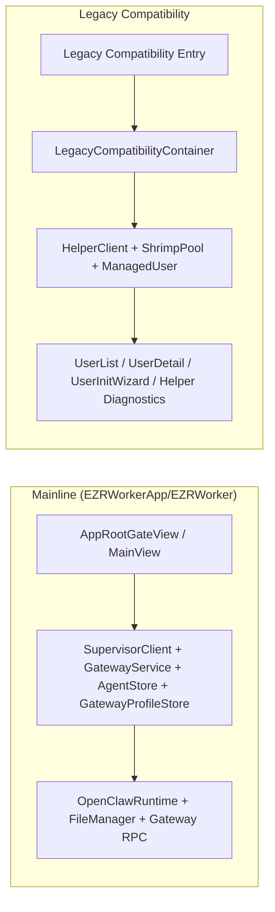

# EZRWorker 新主线完成 Helper 脱钩技术方案

## 当前仓库审计状态（2026-04-22）

- `Phase 1 ~ Phase 4` 已完成：主线启动链、目录边界、legacy 隔离都已落地，`EZRWorkerApp/EZRWorker/` 主线目录不再引用 `HelperClient` / `ShrimpPool` / `ManagedUser` / `GatewayHub`。
- `Phase 3` 是按“功能等价”方式完成的：主线配置、CLI、健康检查已改走现有 `GatewayService` / `GatewayClient` / `GatewayProcessManager` / `OpenClawRuntime` 等 helper-free 路径，而不是严格按草案新增 `GatewayConfigSnapshot` / `ProfileCLIService` / `ProfileHealthCheckService` 这些独立类型。
- `Phase 5` 已完成：`scripts/check-mainline-no-helper.sh`、`Makefile` 目标、`pre-commit` 钩子以及 `.github/workflows/ci.yml` 均已接入，主线 guard 检查与 `EZRWorker` Debug 构建已按同一套命令验证通过。

## 一、背景与结论

现有 `EZRWorker` 已经完成了多 Profile + `EZRWorkerSupervisor` 主线的核心切换：

- `GatewayProcessManager` 已通过 `SupervisorClient` 管理 `start / stop / restart`
- `GatewayProfileStore` 已支持 `legacyReuse` 与 `fresh create`
- `MainView`、`SidebarView`、`ChannelView`、`AgentBindingsView` 等主线 UI 已按当前 profile 运行

立项时，从“**新主线 runtime 是否已经与 helper 解耦**”这个标准看，项目状态仍然是**部分完成**，还差最后一轮收尾：

1. 主窗口启动路径仍然创建并注入 `HelperClient` / `ShrimpPool`
2. `AppBootstrapCoordinator` 仍会在主线 bootstrap 时主动连接 helper
3. `EZRWorkerApp/EZRWorker/` 目录里仍混有 helper 相关类型、legacy 窗口、以及复用旧 `ManagedUser` 语义的 shared sheet
4. 一些 helper 依赖虽然已经不再是主线必经路径，但仍位于主线路径目录中，导致后续改动很容易再次把 helper 渗回主线

换句话说，当前最大问题不是“helper 还承担 gateway lifecycle”，这一点已经切走了；真正没收尾的是：

- **主线与 legacy 兼容层还没有形成明确边界**
- **helper 相关代码仍与新主线共处一个应用组合根中**

本方案的目标不是“马上删掉 helper target”，而是：

- **完成新主线脱钩**
- **把 helper 退回到显式 legacy 兼容层**
- **建立 guardrail，避免 helper 再次回流到新主线**

## 二、目标与非目标

### 2.1 本轮目标

- 新主线窗口从启动到使用，不再创建、连接、等待或依赖 `HelperClient`
- `EZRWorkerApp/EZRWorker/` 下的主线路径不再引用 `HelperClient`、`ShrimpPool`、`ManagedUser`
- legacy 兼容窗口继续保留，但通过显式入口和独立容器接入 helper
- 保留 `EZRWorkerHelper` target、安装脚本与兼容窗口能力，不阻塞已有老用户链路
- 为后续“彻底删除 helper”预留清晰的下一个收口点

### 2.2 本轮非目标

- 不在本轮删除 `EZRWorkerHelper` target
- 不在本轮重写旧多用户 UI 本身的业务逻辑
- 不强制把所有 helper 能力都做 1:1 主线替代
- 不在本轮重构 `GatewayHub` 的 `username` 键控模型

这里有一个重要默认选择：

- **脱钩优先于功能平移。**

也就是说，凡是当前只为旧多用户窗口服务、或者主线没有真实入口的 helper 功能，本轮优先迁到 legacy 兼容层，而不是为了“看起来功能完整”继续让主线背着 helper 跑。

## 三、现状分层

### 3.1 已经符合解耦方向的部分

- `GatewayProcessManager` → `SupervisorClient` 已经接管 lifecycle
- `ChannelView`、`AgentBindingsView` 的重启动作已经走 `processManager.restart()`
- `ConfigEditorSheet` 实际保存已改走 `gatewayHub.configPatch`
- `AgentWorkspaceManager` 的工作区文件读写主体已是 app-local / profile-local
- `ProfileMigrationChoiceView`、`GatewayProfileStore` 已实现迁移选择流

### 3.2 真实的主线阻塞点

这些是完成脱钩必须处理的内容：

| 类别 | 当前文件 | 当前问题 | 目标 |
| --- | --- | --- | --- |
| App 组合根 | `EZRWorkerApp/EZRWorker/App/EZRWorkerApp.swift` | 主窗口与次级窗口共用 `HelperClient` / `ShrimpPool` 注入 | mainline 与 legacy 分开注入 |
| Bootstrap | `EZRWorkerApp/EZRWorker/Services/AppBootstrapCoordinator.swift` | 主线 bootstrap 会主动 `connect()` helper | 主线 bootstrap 完全不接触 helper |
| 目录边界 | `EZRWorkerApp/EZRWorker/` | 主线目录下仍包含 legacy 语义模型与 helper 相关 view/service | 建立 `LegacyCompatibility` 物理隔离 |
| 主线残留类型引用 | `AgentWorkspaceView.swift` 等 | 目录内仍有 `@Environment(HelperClient.self)` 等残留 | 主线目录不再出现 helper 类型 |

### 3.3 helper 污染但并非主线阻塞的内容

这些内容会干扰边界判断，但不应阻塞第一批脱钩落地：

| 文件 | 现状 | 建议 |
| --- | --- | --- |
| `EZRWorkerApp/EZRWorker/Views/ModelConfigWizard.swift` | helper 驱动，且当前仅被 `CLIConfigStep` 引用 | 从主线移出或直接废弃实验性 UI fallback |
| `EZRWorkerApp/EZRWorker/Views/FallbackManagerSheet.swift` | 仅服务 `ModelConfigWizard` | 跟随迁出 |
| `EZRWorkerApp/EZRWorker/Views/CommandOutputPanel.swift` | helper 跑 CLI，当前无主线引用 | 删除或迁到 legacy |
| `EZRWorkerApp/EZRWorker/Views/ConfigEditorSheet.swift` | 文件在主线目录，但实际只被旧 `UserDetailView` 使用 | 迁到 legacy |
| `EZRWorkerApp/EZRWorker/Views/HealthCheckSheet.swift` | helper 驱动，仅旧窗口调用 | 迁到 legacy |
| `EZRWorkerApp/EZRWorker/Views/ModelPrioritySheet.swift` | helper 兜底，仅旧窗口调用 | 迁到 legacy |

### 3.4 明确属于 legacy 的内容

以下内容不需要在本轮重写，只需要**隔离**：

- `EZRWorkerApp/ContentView.swift`
- `EZRWorkerApp/Views/*` 下旧多用户窗口链路
- `EZRWorkerApp/EZRWorker/App/AppSecondaryWindows.swift`
- `EZRWorkerApp/EZRWorker/Models/ManagedUser.swift`
- `EZRWorkerApp/EZRWorker/Services/HelperClient.swift`
- `EZRWorkerApp/EZRWorker/Services/ShrimpPool.swift`
- `EZRWorkerApp/EZRWorker/Services/DaemonInstaller.swift`
- `EZRWorkerApp/EZRWorker/Services/WizardConnection.swift`

## 四、核心设计原则

本轮脱钩锁定以下四条边界：

1. **主线窗口不感知 helper**
   - `AppRootGateView -> MainView -> Agent / Capabilities / Settings / ProfileMigration` 这条链路不允许依赖 helper。

2. **legacy 能力必须通过显式入口进入**
   - helper 只能出现在单独的 legacy 窗口、legacy 诊断、或兼容入口中。

3. **helper 保留，但不是主线底座**
   - helper 可以继续打包、安装、连接，但主线启动成功与否不能建立在 helper 可达之上。

4. **目录边界必须体现依赖边界**
   - 不是只改运行时注入，还要改代码所在路径与 CI 约束，否则 helper 依赖很容易回流。

## 五、目标架构



关键点：

- `mainline` 与 `legacy` 只有“同属一个 app”关系，没有运行时依赖关系
- 主线只依赖：
  - `SupervisorClient`
  - `GatewayService`
  - `GatewayHub`
  - `GatewayProfileStore`
  - `OpenClawRuntime`
  - 本地文件系统
- helper 只依赖 legacy 入口，不再被主窗口 bootstrap

## 六、目录与模块边界重构

### 6.1 新目录边界

建议新增：

```text
EZRWorkerApp/
  EZRWorker/                  # 新主线，只允许当前 profile + current user runtime
  LegacyCompatibility/        # helper / 多用户 / 兼容窗口
  plans/
```

### 6.2 Mainline 允许出现的依赖

`EZRWorkerApp/EZRWorker/` 只允许出现以下依赖族：

- `SupervisorClient`
- `GatewayService`
- `GatewayHub`
- `GatewayProfileStore`
- `AgentStore`
- `AgentWorkspaceManager`
- `OpenClawRuntime`
- `EnvironmentChecker`
- `ProviderKeychainStore`
- `FileManager` / `Process` / `URLSession`

### 6.3 Mainline 禁止出现的依赖

`EZRWorkerApp/EZRWorker/` 内不允许再出现：

- `HelperClient`
- `ShrimpPool`
- `ManagedUser`
- `DaemonInstaller`
- `WizardConnection`
- `EZRWorkerHelperProtocol`

### 6.4 LegacyCompatibility 收口范围

`LegacyCompatibility` 中允许保留：

- `HelperClient`
- `ShrimpPool`
- `ManagedUser`
- `UserListView`
- `UserDetailView`
- `UserInitWizardView`
- `ContentView`
- `DaemonSetupBanner`
- `SettingsView` 中 helper 日志 / helper 服务管理部分

## 七、改造方案

### 7.1 Phase 1: App 组合根脱钩

#### 目标

- 主窗口启动不再创建 helper 依赖链
- helper 只在 legacy 场景需要时才初始化

#### 具体改动

1. `EZRWorkerApp/EZRWorker/App/EZRWorkerApp.swift`
   - 主窗口 `WindowGroup` 不再注入 `helperClient`、`shrimpPool`
   - 将 legacy 窗口的环境注入改为独立容器，而不是复用主窗口容器

2. `EZRWorkerApp/EZRWorker/Services/AppBootstrapCoordinator.swift`
   - 删除 `helperClient.connect()`
   - 删除 `helperClient.waitUntilConnected()`
   - 删除 `helperClient.disconnect()`
   - 删除 `shrimpPool.start()` / `shrimpPool.stop()` 对主线生命周期的耦合

3. 新增 `LegacyCompatibilityContainer`
   - 持有 `HelperClient`
   - 持有 `ShrimpPool`
   - 只供 legacy scenes 使用

#### 推荐实现形态

```swift
final class LegacyCompatibilityContainer {
    let helperClient = HelperClient()
    let shrimpPool: ShrimpPool

    init() {
        shrimpPool = ShrimpPool(helperClient: helperClient)
    }
}
```

主窗口只注入 mainline services；legacy 窗口单独注入 `LegacyCompatibilityContainer` 的成员。

### 7.2 Phase 2: 清理主线目录中的 helper 污染

#### 目标

- `EZRWorkerApp/EZRWorker/` 内只保留真正属于主线的文件
- 把“实际上只被 legacy 调用”的共享 sheet 移出主线目录

#### 处理策略

1. **直接迁出到 legacy**

这些文件不需要重写，直接迁出即可：

- `EZRWorkerApp/EZRWorker/Views/ConfigEditorSheet.swift`
- `EZRWorkerApp/EZRWorker/Views/HealthCheckSheet.swift`
- `EZRWorkerApp/EZRWorker/Views/ModelPrioritySheet.swift`
- `EZRWorkerApp/EZRWorker/App/AppSecondaryWindows.swift`
- `EZRWorkerApp/EZRWorker/Models/ManagedUser.swift`
- `EZRWorkerApp/EZRWorker/Services/HelperClient.swift`
- `EZRWorkerApp/EZRWorker/Services/ShrimpPool.swift`
- `EZRWorkerApp/EZRWorker/Services/DaemonInstaller.swift`
- `EZRWorkerApp/EZRWorker/Services/WizardConnection.swift`

2. **删除未使用 helper UI**

当前没有主线调用、且没有必要继续保留在主线中的文件，整体迁到 legacy 草稿区：

- `EZRWorkerApp/EZRWorker/Views/CommandOutputPanel.swift`
- `EZRWorkerApp/EZRWorker/Views/CLIConfigStep.swift`
- `EZRWorkerApp/EZRWorker/Views/ModelConfigWizard.swift`
- `EZRWorkerApp/EZRWorker/Views/FallbackManagerSheet.swift`

推荐默认选择：

- **不为 `CLIConfigStep` / `ModelConfigWizard` 做 helper-free 重写。**

原因：

- 当前主线已有 `ModelConfigView`、`ProviderKeyRow`、`GatewayHub.configPatch` 等更合适的 gateway-native 路径
- `CLIConfigStep` 目前没有主线调用
- 为了保留一个“实验性 fallback”而继续把 helper 依赖留在主线里，不值得

1. **移除纯残留注入**

例如：

- `AgentWorkspaceView.swift` 中未使用的 `@Environment(HelperClient.self)`
- `ConfigEditorSheet.swift` 中已经不再需要的 helper 注释 / 注入

### 7.3 Phase 3: 用 gateway / local runtime 替代主线剩余 helper 能力

#### 目标

- 主线需要的配置、执行、检查能力全部有 helper-free 的替代路径

#### 7.3.1 配置与模型读取

优先复用现有 gateway-native 能力：

- `GatewayService.configGetFull()`
- `GatewayService.configPatch(...)`
- `GatewayService.modelsList()`
- `GatewayHub.configGetFull(...)`
- `GatewayHub.configPatch(...)`

新增一个轻量快照解析层即可，不需要再通过 helper 读配置：

```text
GatewayConfigSnapshot
  - providers
  - authProfiles
  - defaultModel
  - fallbackModels
  - envRefs
```

推荐新增：

- `EZRWorkerApp/EZRWorker/Models/GatewayConfigSnapshot.swift`
- `EZRWorkerApp/EZRWorker/Services/GatewayConfigResolver.swift`

它们负责把 `configGetFull()` 的原始字典解析成 UI 友好的只读结构，用来替代旧的：

- `helperClient.getConfig(...)`
- `helperClient.getConfigJSON(...)`
- `helperClient.getModelsStatus(...)`

#### 7.3.2 CLI 执行能力

主线如果确实需要跑 `openclaw` CLI，不应该再通过 helper，而应走当前 profile 的本地 runtime：

- 复用 `OpenClawRuntime.runOpenClaw(arguments:profile:)`
- 或对其封装 `ProfileCLIService`

推荐新增：

- `EZRWorkerApp/EZRWorker/Services/ProfileCLIService.swift`

职责：

- 注入当前 `GatewayProfileResolution`
- 统一构造 `OPENCLAW_CONFIG_PATH` / `OPENCLAW_STATE_DIR`
- 返回 `(ok, output)` 结果

这会替代主线路径上的：

- `helperClient.runOpenclawCommand(...)`
- helper 侧 maintenance terminal session

#### 7.3.3 Persona Git 历史

这部分要明确“阻塞项”和“非阻塞项”：

- 当前主线已经可本地读写 workspace
- `commitPersonaFile` / `getPersonaFileHistory` 没有主线调用

因此推荐默认选择：

- **本轮不把 persona Git 历史恢复为脱钩 blocking 项**
- `AgentWorkspaceManager` 先删除 `helperClient` 依赖，只保留：
  - 本地读写
  - `gitHistoryUnavailable`

如果后续需要恢复该能力，再单开一个 `LocalPersonaHistory` 方案：

- 方案 A：基于系统 `/usr/bin/git` 做本地历史
- 方案 B：自定义快照历史，不依赖 git / CLT

但这不应该阻塞本轮主线脱钩。

#### 7.3.4 健康检查

主线健康检查不应再调用 helper：

- 运行时检查：`EnvironmentChecker`
- 进程运行态：`SupervisorClient.listProfilesRuntime()`
- 连接态：`GatewayService.isConnected` + `GatewayClient.health()` / HTTP readyz
- 配置审计：直接读取当前 profile config 文件或 gateway config snapshot

推荐新增：

- `EZRWorkerApp/EZRWorker/Services/ProfileHealthCheckService.swift`

并重新定义主线检查范围：

- bundled runtime 是否存在
- 当前 profile config/state/workspace 路径是否存在
- supervisor 是否已返回 runtime
- gateway token 是否已生成
- gateway health / ready 是否正常

旧 `HealthCheckSheet` 保持 legacy only。

### 7.4 Phase 4: 建立显式 LegacyCompatibility 子系统

#### 目标

- helper 仍可用，但只在显式 compatibility 入口下工作
- 主线设置页不再承载 helper 服务管理心智

#### 具体改动

1. 新增 `LegacyCompatibilityEntryView`
   - 入口可放在 `AppSettingsView` 最底部，作为单独 Section
   - 文案明确说明：
     - 这是旧多用户兼容功能
     - 不属于当前多 profile 主线

2. helper 安装 / 重启 / 日志查看迁到 legacy diagnostics
   - `DaemonInstaller`
   - helper health
   - helper debug logging
   - helper log viewer

3. `AppSecondaryWindows.swift` 迁入 `LegacyCompatibility/App/`
   - `ClawDetailWindow`
   - `UserInitWizardWindow`
   - `MaintenanceTerminalWindow`

4. legacy 视图只通过 legacy container 取依赖

这一步完成后，主线团队与兼容团队的工作边界会明显很多：

- 主线只管 profile + gateway + agent
- legacy 只管 helper + 多用户兼容

### 7.5 Phase 5: 加 guardrail，防止 helper 回流

这是本方案里非常关键的一步。

如果只做一次代码迁移、不加 guardrail，后续很容易因为复用旧 sheet 或“先临时走 helper”再次渗回主线。

#### 推荐新增脚本

- `scripts/check-mainline-no-helper.sh`

核心检查：

```bash
#!/usr/bin/env bash
set -euo pipefail

rg -n "HelperClient|ShrimpPool|ManagedUser|DaemonInstaller|EZRWorkerHelperProtocol" \
  EZRWorkerApp/EZRWorker/App \
  EZRWorkerApp/EZRWorker/Views \
  EZRWorkerApp/EZRWorker/Services \
  EZRWorkerApp/EZRWorker/Models \
  --glob '!**/LegacyCompatibility/**'
```

更稳妥的做法是直接按白名单检查：

- 允许 helper 相关代码只出现在：
  - `EZRWorkerHelper/`
  - `Shared/HelperProtocol.swift`
  - `EZRWorkerApp/LegacyCompatibility/`

#### CI 验收规则

新增一条轻量 CI：

- mainline 路径命中 helper 关键字即失败

推荐关键字：

- `HelperClient`
- `ShrimpPool`
- `ManagedUser`
- `DaemonInstaller`
- `EZRWorkerHelperProtocol`

## 八、实施拆分

### Phase 1: 主线启动链脱钩

目标：

- 主窗口与 bootstrap 不再触碰 helper

改动：

- `EZRWorkerApp/EZRWorker/App/EZRWorkerApp.swift`
- `EZRWorkerApp/EZRWorker/Services/AppBootstrapCoordinator.swift`
- 新增 `LegacyCompatibilityContainer`

验收：

- 主线在 helper 未安装、helper 未连接、helper 崩溃三种情况下都能正常进入主窗口

### Phase 2: 主线目录净化

目标：

- `EZRWorkerApp/EZRWorker/` 不再混放 legacy helper 视图/模型/服务

改动：

- 迁移或删除 helper 污染文件
- 去掉无用 `@Environment(HelperClient.self)` 注入

验收：

- 主线目录中不再包含 helper 相关 shared sheet

### Phase 3: 主线替代能力补齐

目标：

- 主线剩余的配置 / CLI / health 场景均有 helper-free 路径

改动：

- `GatewayConfigSnapshot`
- `GatewayConfigResolver`
- `ProfileCLIService`
- `ProfileHealthCheckService`

验收：

- 主线模型配置、配置修改、运行态检查不再调用 helper

### Phase 4: LegacyCompatibility 隔离

目标：

- legacy 窗口仍可工作，但不再污染主线心智

改动：

- 新建 `EZRWorkerApp/LegacyCompatibility/`
- 迁移旧窗口与 helper diagnostics
- `AppSettingsView` 只保留兼容入口

验收：

- 主线设置页不再出现 helper 为核心的系统说明
- legacy 窗口仍能在 helper 可用时正常打开

### Phase 5: 守护与文档

目标：

- helper 不会再次悄悄渗回主线

改动：

- 新增 grep 检查脚本
- Makefile / CI 接入
- 更新相关技术方案状态

验收：

- CI 能拦住新的 mainline helper 引用

## 九、测试与验收

### 9.1 主线无 helper 启动验证

在 helper 未安装或 helper 无响应时验证：

- 打开 App 能进入 `AppRootGateView`
- `ProfileMigrationChoiceView` 正常工作
- `MainView` 正常显示
- `GatewayProcessManager` 可启动 / 停止 / 重启 profile
- `ChannelView` 和 `AgentBindingsView` 的 restart 继续走 supervisor

### 9.2 目录边界验证

以下命令应无命中：

```bash
rg -n "HelperClient|ShrimpPool|ManagedUser|DaemonInstaller|EZRWorkerHelperProtocol" \
  EZRWorkerApp/EZRWorker
```

如果需要保留极少数例外，必须缩到 `LegacyCompatibility/` 子目录下，而不是继续散落在主线目录。

### 9.3 legacy 回归验证

在 helper 已安装场景下验证：

- legacy 用户详情窗口可打开
- legacy 初始化向导可打开
- helper 日志与重启入口仍可工作

### 9.4 打包与产物验证

本轮默认不变：

- 产物仍包含：
  - `EZRWorker.app`
  - `EZRWorkerHelper`
  - `EZRWorkerSupervisor`
- `project.yml` 仍保留 helper target
- `Makefile` / `scripts/install-helper-dev.sh` 仍可服务 legacy 调试

但新增要求：

- 主线运行不再依赖 helper 安装状态

## 十、默认选择

本方案锁定以下默认项：

1. 本轮目标是“**主线不依赖 helper**”，不是“本轮删除 helper”。
2. 当前没有主线调用的 helper UI，不做平移重写，直接删除或迁到 legacy。
3. persona Git 历史不是本轮 blocking 项，先允许主线继续返回 `gitHistoryUnavailable`。
4. helper 服务管理与日志查看从主线设置页下沉到 legacy diagnostics。
5. 目录边界与 CI guardrail 必须一起落，不接受只做运行时修改。

## 十一、预期产出

本方案完成后，代码库会形成下面这个更稳定的状态：

- `EZRWorkerApp/EZRWorker/` = 真正的多 Profile 主线
- `EZRWorkerApp/LegacyCompatibility/` = helper / 多用户兼容层
- helper 仍存在，但对主线来说是“可选兼容能力”，不再是隐形底座

这会让后续演进明显更顺：

- 如果未来要彻底删除 helper，只需要继续清空 `LegacyCompatibility`
- 如果未来要长期保留 helper，也不会再污染主线架构
