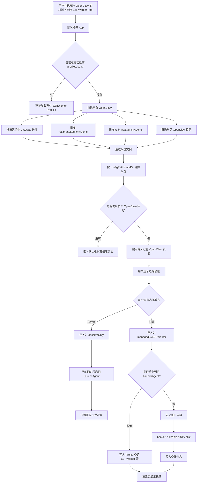
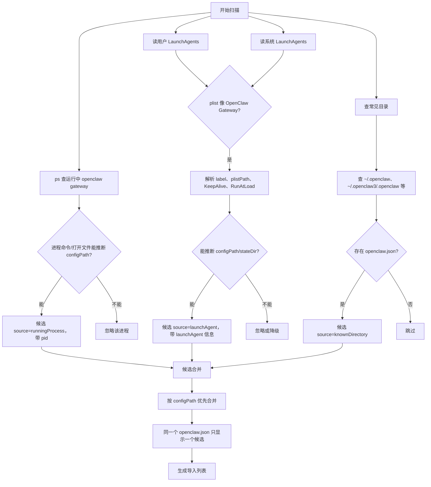
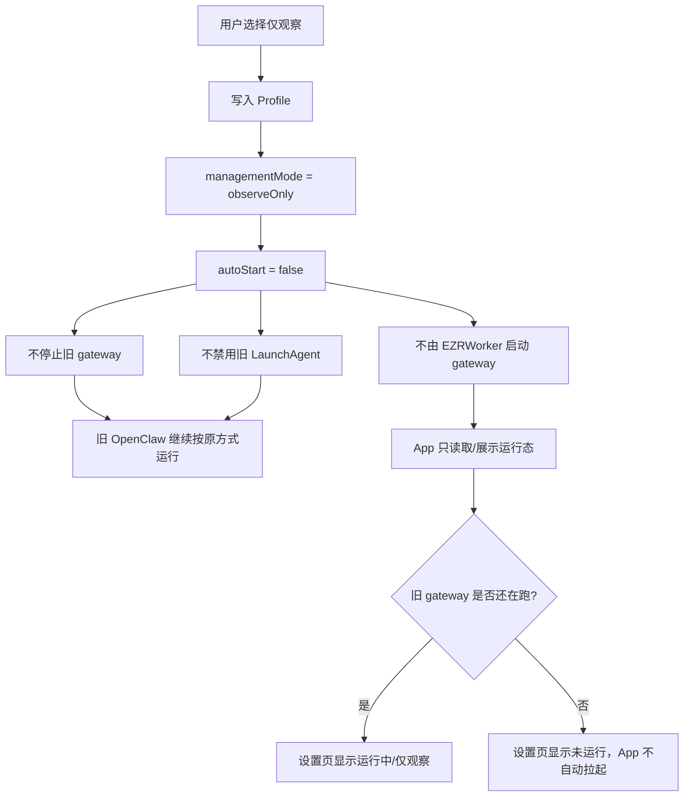
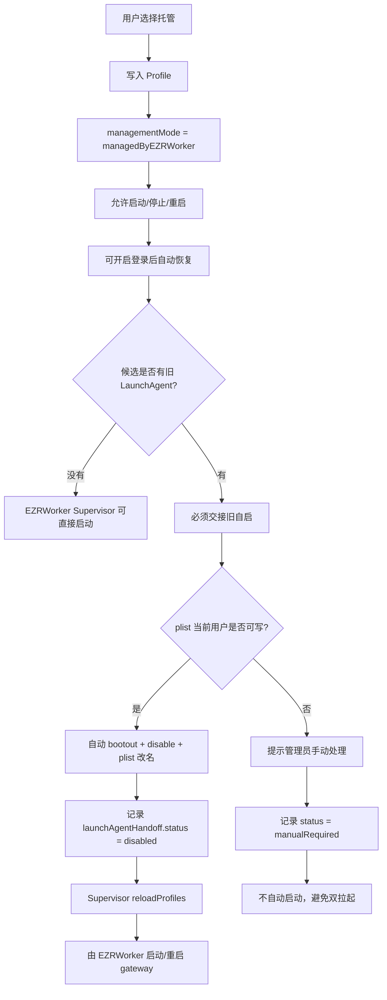
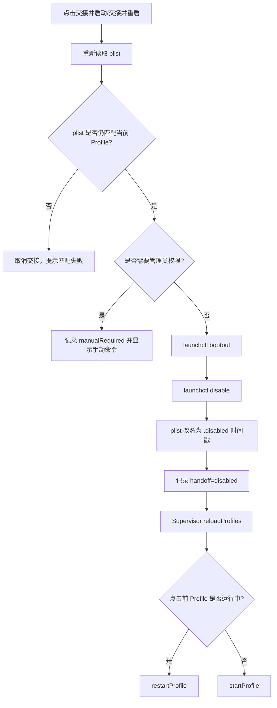
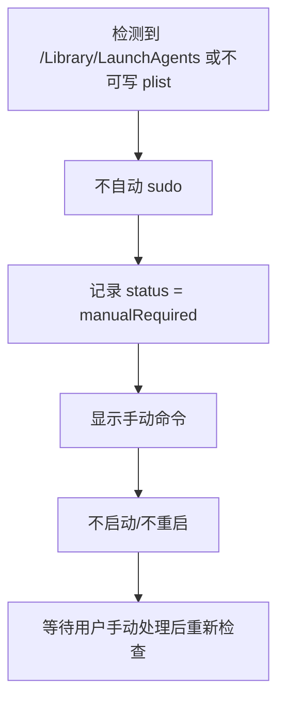
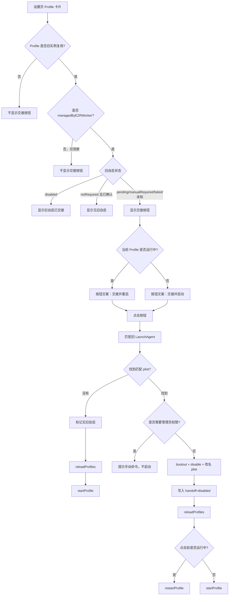
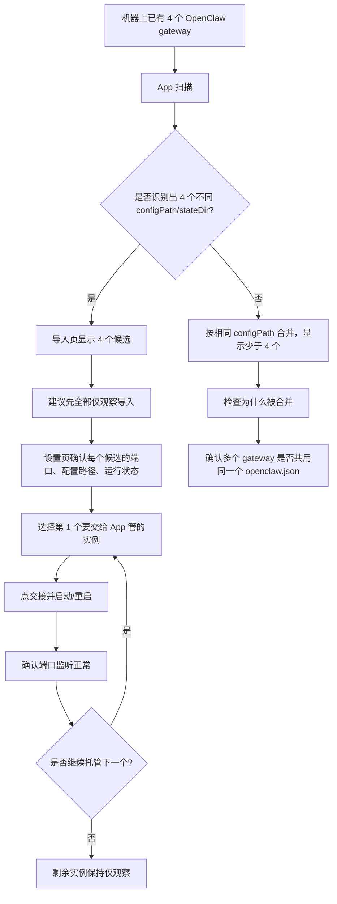

# 既有 OpenClaw 多 Gateway 导入、观察、托管流程图

## 一、适用场景

一台机器上已经安装过 OpenClaw，并且可能已经运行多个 gateway，例如：

```text
~/.openclaw                         port 18789
~/.openclaw3/.openclaw              port 19112
~/.openclaw4/.openclaw              port 19212
其他 openclaw.json/stateDir           port N
```

用户安装 EZRWorker App 后，希望 App 能扫描这些实例，并按需选择：

- 仅观察：App 只看运行态，不接管生命周期。
- 托管：App/EZRWorkerSupervisor 接管启动、停止、重启和登录后恢复。
- 交接旧自启：停用旧 OpenClaw LaunchAgent，避免旧链路和 EZRWorker 双拉起。

## 二、总流程



## 三、扫描逻辑



### 扫描出的候选字段

```text
configPath      该实例使用的 openclaw.json
stateDir        该实例的数据目录
workspaceRoot   工作区目录
port            gateway 端口
pid             当前是否有运行中进程
launchAgent     是否存在旧自启 plist
risk            safe / needsReview / blocked
```

如果机器上“开了 4 个 gateway”，但它们实际共用同一个 `openclaw.json`，导入页会合并成少于 4 个候选。导入粒度以 `configPath/stateDir` 为主，不是以 Chrome renderer 或 gateway 子进程数量为主。

## 四、仅观察模式



仅观察的语义：

```text
App 看，不管。
不改变旧启动链路。
不保证机器重启后由 EZRWorker 恢复。
停止/重启按钮不可用或不会由 EZRWorker 执行。
```

适合先导入、先确认，不想破坏旧机器现状的阶段。

## 五、托管模式



托管的语义：

```text
App 管生命周期。
运行时使用 App 内置 Node/OpenClaw。
配置和状态目录仍指向原实例路径。
模型、渠道、技能等配置继续来自该实例的 openclaw.json/stateDir。
```

## 六、交接旧自启

旧 OpenClaw 可能有 LaunchAgent：

```text
~/Library/LaunchAgents/ai.openclaw.gateway.plist
~/Library/LaunchAgents/com.openclaw.gateway3.plist
/Library/LaunchAgents/com.openclaw.gateway4.plist
```

如果托管时不处理旧 LaunchAgent，会出现：

```text
旧 LaunchAgent       -> 拉起旧 gateway
EZRWorkerSupervisor -> 拉起新 gateway
```

后果：

- 停止后又被旧 KeepAlive 拉起。
- 端口冲突。
- App 运行态判断混乱。
- 机器重启后回到旧 runtime。
- Debug 版和安装版可能同时管理同一个实例。

### 用户态 plist 自动交接



### 系统 plist 或不可写 plist



## 七、设置页按钮逻辑



## 八、4 个 Gateway 的推荐操作路径



推荐顺序：

```text
1. 先全部仅观察导入。
2. 确认每个候选的 port/config/state 都对。
3. 一次只托管一个。
4. 对目标 Profile 点“交接并启动”或“交接并重启”。
5. 确认端口监听、App 运行态、LaunchAgent 状态。
6. 再处理下一个。
```

## 九、关键状态表

| 状态 | 谁启动 Gateway | App 能否停止/重启 | 旧 LaunchAgent 是否保留 | 登录后恢复 |
|---|---|---:|---:|---:|
| 仅观察 | 旧 LaunchAgent 或用户原方式 | 否 | 是 | 由旧链路决定 |
| 托管，未交接 | 不应启动 | 会被保护逻辑阻止 | 是 | 不应恢复 |
| 托管，交接成功 | EZRWorkerSupervisor | 是 | 改名禁用 | 由 EZRWorker 决定 |
| 托管，需要手动 | 暂不自动启动 | 否 | 是，需要手动处理 | 不应恢复 |
| 托管，无旧自启 | EZRWorkerSupervisor | 是 | 无 | 由 EZRWorker 决定 |

## 十、排查命令

查看当前哪些端口在监听：

```bash
lsof -nP -iTCP -sTCP:LISTEN | grep -E '18789|18809|19112|19212|19789'
```

查看 OpenClaw 相关进程：

```bash
ps -axo pid,ppid,user,command | grep -i openclaw
```

查看旧 OpenClaw LaunchAgent：

```bash
ls ~/Library/LaunchAgents | grep -i openclaw
launchctl print gui/$(id -u)/ai.openclaw.gateway
```

查看安装版 EZRWorker Supervisor：

```bash
launchctl print gui/$(id -u)/ai.ezrworker.mac.supervisor
```

查看 Debug 版 EZRWorker Supervisor：

```bash
launchctl print gui/$(id -u)/ai.ezrworker.mac.dev.supervisor
```

查看安装版 profiles：

```bash
cat "$HOME/Library/Application Support/EZRWorker/profiles.json"
```

查看 Debug 版 profiles：

```bash
cat "$HOME/Library/Application Support/EZRWorker-Dev/profiles.json"
```

## 十一、一句话总结

```text
仅观察 = App 看，不管。
托管 = App 管生命周期。
交接旧自启 = 拿掉旧 LaunchAgent 的拉起权。
交接并启动/重启 = 拿掉旧自启后，立刻让 EZRWorkerSupervisor 接手运行。
```
