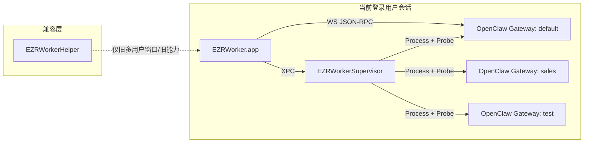

# EZRWorker 多 OpenClaw Gateway + Global Supervisor 技术方案

## 一、背景与目标

当前 `EZRWorker` 新主线已经从旧的多用户虾池模型收敛到“当前用户下单个 OpenClaw gateway + 多 agent 管理”，但代码里仍然存在以下问题：

1. **运行时仍是单实例心智模型**
   - 默认固定读写 `~/.openclaw`
   - 默认连接固定端口
   - `GatewayService`、`GatewayProcessManager`、`AgentWorkspaceManager` 等服务天然按“单 gateway”设计

2. **新主线和旧 helper 兼容链路仍然耦合**
   - 新主线的 workspace 文件读写仍通过 `HelperClient`
   - 一些“配置变更后重启 gateway”的路径仍调用 helper
   - 旧多用户 `ShrimpPool` 仍与主 app 同时注入

3. **品牌与工程命名不统一**
   - 仓库/project 仍叫 `EZRWorker`
   - 运行时产品名已是 `EZRWorker`
   - App Support、Keychain、Mach service、pkg、文档、脚本在旧草案阶段仍大量保留旧品牌标识

本方案的目标是：

- 将运行时升级为“**当前登录用户下多个 OpenClaw gateway/profile 并行运行**”
- 为每个 gateway 实例引入 profile 抽象
- 使用一个全局用户态 `EZRWorkerSupervisor` LaunchAgent 托管所有 profile lifecycle
- 将运行时品牌统一为 `EZRWorker`
- 为老单实例用户提供首启迁移选项：**复用老的** 或 **创建新的**

## 二、核心概念

### 2.1 Profile 与 Main 的关系

- `profile` = 一个 OpenClaw gateway 实例
- `main` = 该 profile 内部的默认 agent
- `main` 不再是全局唯一，而是“每个 profile 默认都有自己的 `main` agent”

也就是说：

```text
default profile
  -> main agent
  -> work agent
  -> social agent

sales profile
  -> main agent
  -> leads agent

test profile
  -> main agent
```

### 2.2 为什么采用一个全局 supervisor LaunchAgent

不采用“每个 profile 一个 LaunchAgent”的原因：

1. profile 改名、删 profile、改路径、改端口时，需要同步管理多个 plist，容易留下孤儿项
2. 多 profile 场景下 launchd 配置会变得分散，调试和排障成本高
3. 生命周期收敛逻辑应集中在一处，而不是分散到多个 LaunchAgent job

因此采用：

- 一个全局 LaunchAgent：`ai.ezrworker.mac.supervisor`
- 一个用户态后台进程：`EZRWorkerSupervisor`
- 它读取 `profiles.json`，统一 reconcile 所有 `autoStart = true` 的 profile

## 三、命名与工程结构重构

### 3.1 统一命名

本方案统一采用仓库里现有的拼写：

- `EZRWorker`

不使用：

- `EZRWroker`

### 3.2 运行时身份

| 项目 | 新值 |
| --- | --- |
| App 名称 | `EZRWorker.app` |
| App 安装路径 | `/Applications/EZRWorker.app` |
| App bundle id | `ai.ezrworker.mac` |
| Helper 名称 | `EZRWorkerHelper` |
| Helper bundle id | `ai.ezrworker.mac.helper` |
| Supervisor 名称 | `EZRWorkerSupervisor` |
| Supervisor Mach service / label | `ai.ezrworker.mac.supervisor` |
| App Support 根目录 | `~/Library/Application Support/EZRWorker/` |
| os_log subsystem | `ai.ezrworker.mac` |
| User-Agent 前缀 | `EZRWorker/<version>` |
| 默认 pkg 名称 | `EZRWorker-<version>.pkg` |

### 3.3 工程与目录结构

Xcode 工程结构统一为：

```text
EZRWorker.xcodeproj

EZRWorkerApp/
  App/
  Services/
  Models/
  Views/
  Resources/
  Utils/

EZRWorkerHelper/
  main.swift
  Operations/

EZRWorkerSupervisor/
  main.swift
  Services/
  Models/

Shared/
Resources/
scripts/
tests/
```

说明：

- 现有 `EZRWorkerApp/EZRWorker/*` 主线代码提升到 `EZRWorkerApp/*`
- 旧窗口链路仍归入 `EZRWorkerApp/Views`
- `EZRWorkerHelper` 保留旧多用户兼容能力
- `EZRWorkerSupervisor` 是新增 target，负责新 profile runtime

## 四、总体架构

### 4.1 组件关系



### 4.2 职责边界

#### `EZRWorker.app`

- Profile 管理 UI
- 首启迁移选择页
- 当前选中 profile 的完整业务上下文
  - `GatewayService`
  - `AgentStore`
  - `AgentWorkspaceManager`
  - `Channel / Skills / Settings`
- 品牌迁移与本地数据迁移
- 调用 `SupervisorClient` 控制 lifecycle

#### `EZRWorkerSupervisor`

- 读取 `profiles.json`
- 解析每个 profile 的运行配置
- `prepare / start / stop / restart / reloadProfiles`
- 登录后自动恢复 `autoStart = true` 的 profile
- 维护运行状态、pid、端口、最近错误和探活状态
- adopt 已存在的同 profile 进程

#### `EZRWorkerHelper`

- 保留旧多用户、旧窗口、旧运维链路
- 不参与新 profile runtime
- 不再承载新主线 gateway 的 lifecycle

## 五、Profile 数据模型

### 5.1 持久化文件

- `~/Library/Application Support/EZRWorker/profiles.json`

格式：

```json
{
  "version": 1,
  "profiles": []
}
```

### 5.2 GatewayProfile

```swift
struct GatewayProfile: Codable, Identifiable, Equatable {
    let id: UUID
    var slug: String
    var displayName: String
    var autoStart: Bool
    var sourceKind: SourceKind
    var configPathOverride: String?
    var stateDirOverride: String?
    var workspaceRootOverride: String?
    var portOverride: Int?
    var createdAt: Date
}
```

```swift
enum SourceKind: String, Codable {
    case managed
    case legacyReuse
}
```

约束：

- `slug` 全局唯一
- `slug` 创建后不可修改
- 所有 override 路径必须是绝对路径
- `portOverride` 若存在，必须通过端口段冲突校验
- 基础端口之间至少间隔 `20`，为 browser/canvas/CDP 等派生端口预留空间
- 当前选中 profile 不写入 `profiles.json`，而是写入：
  - `UserDefaults("ai.ezrworker.mac.lastSelectedProfileID")`

### 5.3 SupervisorProfileRuntime

由 supervisor 提供的运行态模型，至少包含：

```swift
struct SupervisorProfileRuntime: Codable, Identifiable {
    let profileID: UUID
    let slug: String
    let displayName: String
    let resolvedConfigPath: String
    let resolvedStateDir: String
    let resolvedWorkspaceRoot: String
    let resolvedPort: Int
    let isPrepared: Bool
    let isRunning: Bool
    let pid: Int32?
    let readyState: ReadyState
    let ownership: Ownership
    let lastProbeAt: Date?
    let lastError: String?
}
```

其中：

```swift
enum ReadyState: String, Codable {
    case stopped
    case starting
    case ready
    case unhealthy
}

enum Ownership: String, Codable {
    case supervised   // 由 supervisor 启动
    case adopted      // 已存在进程被接管
}
```

## 六、运行时路径与解析规则

### 6.1 App 侧元数据

- `~/Library/Application Support/EZRWorker/`
  - `profiles.json`
  - `secrets.json`
  - `global-models.json`
  - `device-identity-v1.json`
  - 其他仅 App 侧持有的本地状态文件

### 6.2 默认 profile 路径

默认 profile 根目录：

- `~/Library/Application Support/EZRWorker/profiles/<slug>/`

默认解析规则：

- `configPath = <profileRoot>/openclaw.json`
- `stateDir = <profileRoot>/state`
- `workspaceRoot = <stateDir>/workspace`
- `mainWorkspace = workspaceRoot`
- `workspace(agentId != "main") = workspaceRoot + "-<agentId>"`
- `agentDir = <stateDir>/agents/<agentId>/agent`
- `sessionsDir = <stateDir>/agents/<agentId>/sessions`

### 6.3 可覆盖项

高级设置支持：

- `OPENCLAW_CONFIG_PATH`
- `OPENCLAW_STATE_DIR`
- `workspaceRoot`
- `port`

保存 profile 时校验：

1. `slug` 唯一
2. 路径必须是绝对路径
3. 路径父目录可创建或已存在
4. `port` 在允许范围内且未与其他 profile 冲突

## 七、Supervisor 与 LaunchAgent

### 7.1 LaunchAgent 设计

LaunchAgent 文件：

- `/Library/LaunchAgents/ai.ezrworker.mac.supervisor.plist`

关键配置：

```xml
<key>Label</key>
<string>ai.ezrworker.mac.supervisor</string>

<key>BundleProgram</key>
<string>Contents/MacOS/EZRWorkerSupervisor</string>

<key>MachServices</key>
<dict>
  <key>ai.ezrworker.mac.supervisor</key>
  <true/>
</dict>

<key>RunAtLoad</key>
<true/>

<key>KeepAlive</key>
<true/>

<key>ProcessType</key>
<string>Background</string>

<key>LimitLoadToSessionType</key>
<string>Aqua</string>
```

### 7.2 pkg 安装行为

pkg 安装时：

1. 安装 `EZRWorker.app`
2. 安装 `ai.ezrworker.mac.supervisor.plist`
3. 针对当前 console user 执行一次：
   - `launchctl bootstrap gui/<uid> /Library/LaunchAgents/ai.ezrworker.mac.supervisor.plist`
4. 使 supervisor 在安装完成后即可运行

### 7.3 Autostart 语义

`autoStart = true` 的正式含义：

- 用户登录 macOS 后，由 supervisor 自动恢复该 profile

不再仅仅表示：

- 打开 App 时自动启动

## 八、App 与 Supervisor 接口

### 8.1 协议设计

新协议文件：

- `Shared/SupervisorProtocol.swift`

采用用户态 XPC，复杂返回值统一 JSON 字符串。

```swift
@objc protocol EZRWorkerSupervisorProtocol: NSObjectProtocol {
    func ping(withReply reply: @escaping (Bool) -> Void)

    func listProfilesRuntime(withReply reply: @escaping (String) -> Void)

    func prepareProfile(
        profileID: String,
        withReply reply: @escaping (Bool, String?) -> Void
    )

    func startProfile(
        profileID: String,
        withReply reply: @escaping (Bool, String?) -> Void
    )

    func stopProfile(
        profileID: String,
        withReply reply: @escaping (Bool, String?) -> Void
    )

    func restartProfile(
        profileID: String,
        withReply reply: @escaping (Bool, String?) -> Void
    )

    func reloadProfiles(
        withReply reply: @escaping (Bool, String?) -> Void
    )
}
```

### 8.2 SupervisorClient

App 新增：

- `EZRWorkerApp/Services/SupervisorClient.swift`

职责：

- 连接 `ai.ezrworker.mac.supervisor`
- 提供 `waitUntilConnected()`
- 封装 JSON 解码
- 暴露 App 友好的 async API

### 8.3 当前 profile 上下文

App 仍然需要当前选中 profile 的完整业务上下文：

- `GatewayService`
- `AgentStore`
- `AgentWorkspaceManager`

但这些服务只绑定 **当前选中的一个 profile**。

其他 profile 即使在后台运行，也只通过 supervisor 提供轻量运行状态，不建立完整 WebSocket/store。

## 九、Profile 生命周期

### 9.1 `prepareProfile(profileID)`

固定步骤：

1. 读取 profile
2. 解析 `configPath / stateDir / workspaceRoot / port`
3. 创建基础目录
4. 执行：
   - `openclaw setup`
5. 同时注入：
   - `OPENCLAW_CONFIG_PATH=<resolvedConfigPath>`
   - `OPENCLAW_STATE_DIR=<resolvedStateDir>`
6. setup 完成后直接规范化 `openclaw.json`
7. 强制写入：
   - `gateway.port = resolvedPort`
   - `gateway.mode = local`
   - `gateway.controlUi.allowInsecureAuth = true`
8. `prepareProfile` 不强制要求 `gateway.auth.token` 已存在
9. `gateway.auth.token` 允许在首次 `gateway` 启动阶段由 OpenClaw 生成并回写配置

### 9.2 `startProfile(profileID)`

固定行为：

1. 若 profile 未 prepared，则先失败并提示调用 prepare
2. 启动：
   - `openclaw gateway`
3. 注入：
   - `OPENCLAW_CONFIG_PATH`
   - `OPENCLAW_STATE_DIR`
4. 使用 bundled `node/openclaw` 与统一 PATH
5. 若 resolvedPort 上已有该 profile 对应 ready 进程，则 adopt
6. 否则按目标配置启动
7. supervisor 管理的 profile 以显式路径隔离为准，不再叠加 OpenClaw 原生 `--profile`

### 9.3 `stopProfile(profileID)`

- 仅停止当前 profile 对应的 gateway
- 不影响其他 profile
- 终止后等待端口和进程都收敛为 stopped

### 9.4 `restartProfile(profileID)`

- stop 后再按当前 resolved 配置 start
- 若配置路径、端口、stateDir 已变化，则 restart 必须使新配置生效

## 十、首次安装与首次打开

### 10.1 纯新机器、无旧数据

1. 安装 pkg，LaunchAgent 与 supervisor 就位
2. 第一次打开 App
3. 若不存在 `profiles.json` 且不存在 `~/.openclaw/openclaw.json`
4. App 自动创建 `default` profile，`sourceKind = managed`
5. App 调用 `reloadProfiles()`
6. 若 `default` 尚未 ready，则调用 `startProfile(default)`
7. `startProfile(default)` 内部负责按需 prepare
8. App 连接当前 profile，并确保 `default/main` 初始化完成

### 10.2 `default/main` 的含义

- `default` 是默认 profile slug
- `main` 是这个 profile 内部默认 agent
- 不是整个系统唯一的 `main`

## 十一、老单实例用户首次升级迁移

### 11.1 触发条件

满足以下条件时弹出迁移选择页：

1. `~/Library/Application Support/EZRWorker/profiles.json` 不存在
2. 旧单实例配置 `~/.openclaw/openclaw.json` 存在

### 11.2 迁移页行为

- 阻塞式引导页
- 用户未选择前不进入主界面
- 默认预选：
  - **复用老的**

选项只有两个：

1. **复用老的**
2. **创建新的**

### 11.3 选择“复用老的”

创建一个 `default` profile：

- `sourceKind = legacyReuse`
- `configPathOverride = ~/.openclaw/openclaw.json`
- `stateDirOverride = ~/.openclaw`
- `workspaceRootOverride = ~/.openclaw/workspace`
- `portOverride = 读取旧 openclaw.json 中的 gateway.port`

这条路径的规则：

- 不执行 fresh setup
- 只做 prepare 校验与 start/adopt
- 直接接管旧 token、旧 agents、旧 bindings、旧 channels 数据
- 不搬迁 `~/.openclaw`

### 11.4 选择“创建新的”

创建一个全新的 `default` profile：

- `sourceKind = managed`
- 路径在：
  - `~/Library/Application Support/EZRWorker/profiles/default/`

然后执行：

- `prepare + start`

这条路径的规则：

- 不修改旧 `~/.openclaw`
- 旧单实例数据保留原样
- 在 Settings / Profile 管理中保留：
  - “导入现有 ~/.openclaw 为第二个 profile”

### 11.5 迁移完成标志

一旦任一路径成功写出 `profiles.json`，本轮迁移视为完成，不再重复弹窗。

## 十二、多 Profile 创建与运行

### 12.1 新建 Profile

用户点击“新建 Gateway/Profile”时：

1. App 创建新的 `GatewayProfile`
2. 默认 `sourceKind = managed`
3. 未填写高级配置时，自动生成路径与空闲端口
4. App 写入 `profiles.json`
5. 调用 `reloadProfiles()`
6. 若需要预热但暂不启动，可单独调用 `prepareProfile(profileID)`
7. 若勾选“自动启动”，直接调用 `startProfile(profileID)`
8. `startProfile(profileID)` 内部负责按需 prepare

### 12.2 每个 Profile 默认拥有 `main`

每个 fresh profile 在首次连接成功后，由 App 负责确保该 profile 下存在默认 agent：

- `main`

该 profile 内其他 agent 的路径全部从当前 profile 的 resolved 路径导出。

## 十三、应用与品牌迁移

### 13.1 App Support 迁移

新增：

- 品牌迁移逻辑（当前版本已取消）

最早设计为首次打开 App 时执行文件与 Keychain 迁移；
当前因为决定直接切换命名且无存量用户，这部分实现已删除。

### 13.2 Keychain 迁移

最早设计为“若新 service 无数据，则把旧 service 迁移到新 service”；
当前版本直接使用新 service，不再保留这段兼容逻辑。

### 13.3 `~/.openclaw` 的处理原则

`~/.openclaw` 不参加品牌迁移。

它只作为：

1. `legacyReuse` profile 的 source
2. 用户后续显式导入的旧实例来源

## 十四、新主线与 Helper 的解耦

新主线 runtime 不再依赖 helper，具体包括：

- `AgentWorkspaceManager` 改为 app-local 路径读写
- `ChannelView`、`AgentBindingsView` 改为通过 supervisor 重启 gateway
- 新 profile 的 `prepare / start / stop / restart` 不走 helper

Helper 的新定位：

- 仅保留旧多用户视图与兼容能力
- 名称改为 `EZRWorkerHelper`
- 不再承载新主线路径上的 gateway lifecycle

## 十五、工程实施拆分

### Phase 1: 品牌与工程重命名

- `project.yml` 改名并新增 `EZRWorkerSupervisor`
- Xcode project、target、bundle id、pkg 名称统一为 `EZRWorker`
- App Support、Keychain、UserDefaults、os_log subsystem、User-Agent 切换到 `ezrworker`
- helper 相关 plist、脚本、Mach service 改名为 `EZRWorkerHelper`

### Phase 2: Supervisor 与 LaunchAgent

- 新建 `EZRWorkerSupervisor` target
- 新建 `Resources/ai.ezrworker.mac.supervisor.plist`
- 实现 XPC listener 与 `EZRWorkerSupervisorProtocol`
- 在 pkg 安装流程中安装并 bootstrap LaunchAgent

### Phase 3: Profile 模型与 Store

- 新建 `GatewayProfileStore`
- 新建 `Shared/SupervisorProtocol.swift`
- 新建 profile 元数据模型与 runtime 模型
- 处理默认路径解析与 override 校验

### Phase 4: App 接入 Profile Runtime

- 新增 `SupervisorClient`
- 当前 profile 的 `GatewayService / AgentStore / AgentWorkspaceManager` 改为按 profile 绑定
- 新增 Profiles Overview UI
- Settings 中新增 Profile 管理页

### Phase 5: 迁移与兼容

- 评估并最终移除品牌迁移逻辑
- 实现首启迁移选择页
- 实现 legacyReuse 与 fresh create 两条路径
- 保留旧 helper 兼容窗口

## 十六、测试与验收

### 16.1 品牌与产物

- 构建产物为：
  - `EZRWorker.app`
  - `EZRWorkerHelper`
  - `EZRWorkerSupervisor`
- bundle id、Mach service、User-Agent、pkg 名称不再含旧品牌标识

### 16.2 LaunchAgent

- pkg 安装后 LaunchAgent 正确落盘并 bootstrap
- 不打开 App 也能在登录后自动恢复 `autoStart` profile

### 16.3 Fresh Install

- 全新机器首次打开自动创建 `default` profile
- 完成 `prepare + start + main 初始化`

### 16.4 Legacy Migration

- 检测到旧单实例时出现迁移选择页
- 默认选中“复用老的”
- `复用老的` 后旧 `~/.openclaw` 直接可用
- `创建新的` 后新 profile 正常运行，旧 `~/.openclaw` 不被修改
- `创建新的` 后可从设置中再导入旧实例

### 16.5 多 Profile

- 两个 profile 使用不同 config/state/workspace/port 可同时运行
- 切换当前 profile 后 Agents/Channels/Skills/Settings 全部跟随切换
- 绑定变更后的 restart 走 supervisor，不再依赖 helper

### 16.6 品牌迁移

- `Application Support/EZRWorker` 与旧 Keychain service 能被正确迁入 `EZRWorker`
- 旧 helper 兼容窗口在重命名后仍可连接 `EZRWorkerHelper`

## 十七、默认选择与约束

本方案锁定以下默认项：

1. 品牌拼写采用 `EZRWorker`
2. 运行时采用一个全局 supervisor LaunchAgent，不采用每 profile 一个 LaunchAgent
3. 老单实例用户首启迁移默认预选：
   - **复用老的**
4. 首启迁移选择页为阻塞式引导
5. `default` 是默认 profile slug；如冲突则自动追加数字后缀
6. 外部官网域名与下载站短期内可以继续使用 `clawdhome.app`，仓库内运行时身份先切到 `EZRWorker`

## 十八、附：当前方案对应的用户体验

### 新电脑新装

```text
安装 EZRWorker.pkg
  -> LaunchAgent 安装并 bootstrap
  -> 第一次打开 App
  -> 自动创建 default profile
  -> prepare default
  -> start default
  -> 初始化 default/main
  -> 进入 default profile 管理界面
```

### 老单实例升级

```text
打开新版 EZRWorker.app
  -> 检测到 ~/.openclaw/openclaw.json
  -> 弹出迁移选择页
  -> 默认预选“复用老的”
  -> 用户确认后写入 profiles.json
  -> adopt / start legacy profile
  -> 进入 default profile 管理界面
```

### 登录系统后自动恢复

```text
用户登录 macOS
  -> launchd 启动 EZRWorkerSupervisor
  -> supervisor 读取 profiles.json
  -> 对 autoStart = true 的 profile 做 reconcile
  -> 相关 gateway 在后台运行
  -> 用户之后再打开 App，只是连接和管理它们
```
